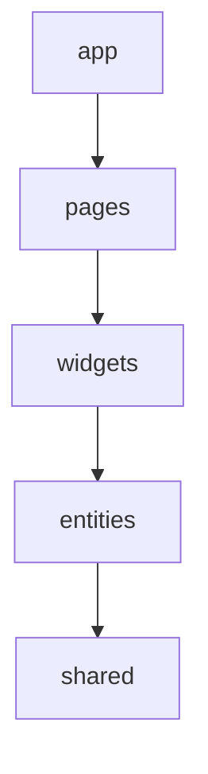

# golang-refine-cms-app

블로그형 CMS. 백엔드(Go)와 어드민 대시보드(refine)로 구성된 모노레포.

```
.
├── backend/    # Go 백엔드 (미구현)
├── dashboard/  # 어드민 대시보드 (refine)
└── docs/       # API 명세 (swagger.json, api.md) — BE 전달용
```

## 아키텍처 결정사항 (Architecture Decisions)

### 대시보드 프레임워크
- **대시보드는 [refine](https://refine.dev) (v5)로 구성한다.** 신규 어드민/CRUD 화면은 refine 훅(`useTable`, `useForm`, `useShow`, `useSelect`, `useMany`, `useNavigation` 등)을 사용한다.
- **headless 구성** — refine 내장 UI를 쓰지 않고 UI는 직접 구현한다.

### UI
- **[shadcn/ui](https://ui.shadcn.com) (new-york 스타일) + Tailwind CSS v4 + Radix UI.**
- UI 컴포넌트는 `dashboard/src/shared/ui/`에 둔다(`components.json`의 alias가 `@/shared/ui`로 설정됨).
- 아이콘은 `lucide-react`, 토스트는 `sonner`(refine notificationProvider로 연결).

### 소스 구조: Feature-Sliced Design (FSD)
`dashboard/src/`는 FSD 레이어로 구성한다. import는 **상위 → 하위 방향만** 허용한다.



| 레이어 | 위치 | 역할 |
| --- | --- | --- |
| `app` | `src/app` | 앱 초기화: Refine provider, router, 라우트 정의 |
| `pages` | `src/pages` | 리소스별 list/create/edit/show 화면 |
| `widgets` | `src/widgets` | 레이아웃(`layout`), CRUD 공통 액션(`crud-actions`) 등 합성 UI 블록 |
| `entities` | `src/entities` | 도메인 모델/타입(post, category, tag, comment) |
| `shared` | `src/shared` | UI 키트(`ui`), 유틸(`lib`), 설정(`config`), API(`api`) |

- import alias: `@` → `dashboard/src` (`vite.config.ts`, `tsconfig.app.json`).
- 각 슬라이스는 배럴(`index.ts`)로 공개 API를 노출하고, 다른 슬라이스는 배럴을 통해서만 참조한다.

### 데이터 / API
- **데이터 프로바이더: `@refinedev/simple-rest`** (json-server 스타일 규약).
- **API 호스트: `http://localhost:9000`** (백엔드 미구현 상태). `dashboard/.env`의 `VITE_API_URL`로 덮어쓸 수 있다.
- API 명세는 **`docs/swagger.json`(OpenAPI 3.0) + `docs/api.md`** 에 정의되어 있으며 BE 구현 기준이다.
  - 목록 응답은 `X-Total-Count` 헤더 필수, 수정은 `PATCH`, CORS에서 해당 헤더 expose 필요.
- 라우팅: `@refinedev/react-router` + `react-router` v7.
- 테이블: `@refinedev/react-table` + `@tanstack/react-table`. 폼: `@refinedev/react-hook-form` + `react-hook-form`.

### 리소스 / 도메인 모델
- `posts`, `categories`, `tags`, `comments` (관계: category 1:N post, post 1:N comment, post M:N tag).
- `status` enum은 `draft | published | rejected` (posts·comments 공통).

## 코딩 규약 (dashboard)
- `verbatimModuleSyntax` 활성화 — 타입 import는 반드시 `import type` 사용.
- `erasableSyntaxOnly` — TS `enum`/`namespace` 금지. 상태값 등은 `as const` 유니온 타입으로 정의(`entities/*/model/types.ts` 참고).
- refine v5 데이터 훅은 `{ query, result }`를 반환한다(`result`로 데이터 접근). `useTable`은 `{ reactTable, refineCore }`를 반환한다(tanstack 인스턴스는 `reactTable`).

## 명령어 (dashboard/)
```bash
npm run dev      # 개발 서버
npm run build    # 타입체크(tsc -b) + 프로덕션 빌드
npm run lint     # ESLint
```
