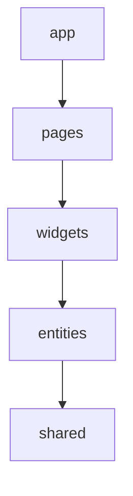

# golang-refine-cms-app

블로그형 CMS. 백엔드(Go)와 어드민 대시보드(refine)로 구성된 모노레포.

```
.
├── backend/                  # Go 백엔드 (Gin · 헥사고날 아키텍처) — 상세는 backend/CLAUDE.md
├── frontend/                 # 프런트엔드 pnpm 모노레포 (workspace)
│   ├── pnpm-workspace.yaml
│   ├── package.json          # 워크스페이스 루트
│   └── apps/
│       ├── dashboard/        # 어드민 대시보드 (refine) — 관리자 API(/admin/api/v1)
│       └── web/              # 사용자용 웹앱 (공개 블로그) — 공개 API(/api/v1)
└── docs/                     # 관리자 API 명세 (swagger.json, api.md, admin-auth.md) — BE 전달용
```

> 백엔드 코드 작업 시에는 `backend/CLAUDE.md`(헥사고날 레이어 규칙)를 우선 따른다.
> 프런트엔드는 **pnpm 모노레포**(`frontend/`)이며 패키지 매니저는 **pnpm**을 사용한다. 새 프런트엔드 앱/패키지는 `frontend/apps/*` · `frontend/packages/*`에 추가한다.

## 아키텍처 결정사항 (Architecture Decisions)

### 대시보드 프레임워크
- **대시보드는 [refine](https://refine.dev) (v5)로 구성한다.** 신규 어드민/CRUD 화면은 refine 훅(`useTable`, `useForm`, `useShow`, `useSelect`, `useMany`, `useNavigation` 등)을 사용한다.
- **headless 구성** — refine 내장 UI를 쓰지 않고 UI는 직접 구현한다.

### UI
- **[shadcn/ui](https://ui.shadcn.com) (new-york 스타일) + Tailwind CSS v4 + Radix UI.**
- UI 컴포넌트는 `frontend/apps/dashboard/src/shared/ui/`에 둔다(`components.json`의 alias가 `@/shared/ui`로 설정됨).
- 아이콘은 `lucide-react`, 토스트는 `sonner`(refine notificationProvider로 연결).

### 소스 구조: Feature-Sliced Design (FSD)
`frontend/apps/dashboard/src/`는 FSD 레이어로 구성한다. import는 **상위 → 하위 방향만** 허용한다.



| 레이어 | 위치 | 역할 |
| --- | --- | --- |
| `app` | `src/app` | 앱 초기화: Refine provider, router, 라우트 정의 |
| `pages` | `src/pages` | 리소스별 list/create/edit/show 화면 |
| `widgets` | `src/widgets` | 레이아웃(`layout`), CRUD 공통 액션(`crud-actions`) 등 합성 UI 블록 |
| `entities` | `src/entities` | 도메인 모델/타입(post, category, tag, comment) |
| `shared` | `src/shared` | UI 키트(`ui`), 유틸(`lib`), 설정(`config`), API(`api`) |

- import alias: `@` → `apps/dashboard/src` (`vite.config.ts`, `tsconfig.app.json`).
- 각 슬라이스는 배럴(`index.ts`)로 공개 API를 노출하고, 다른 슬라이스는 배럴을 통해서만 참조한다.

### 데이터 / API
- **데이터 프로바이더: `@refinedev/simple-rest`** (json-server 스타일 규약).
- **관리자 API 네임스페이스는 사용자용과 분리한다.**
  - 사용자(public) API: `/api/v1` (기존 백엔드 컨벤션, 대시보드 범위 밖)
  - **관리자(admin) API: `/admin/api/v1`** (대시보드 전용). 대시보드 베이스 URL = `http://localhost:9000/admin/api/v1` (`frontend/apps/dashboard/.env`의 `VITE_API_URL`로 변경).
- 관리자 API 명세는 **`docs/swagger.json`(OpenAPI 3.0) + `docs/api.md`** 에 정의되어 있으며 BE 구현 기준이다.
  - 목록 응답은 배열 + `X-Total-Count` 헤더 필수, 수정은 `PATCH`, 필드 네이밍 camelCase, CORS에서 해당 헤더 expose 필요.
- 라우팅: `@refinedev/react-router` + `react-router` v7.
- 테이블: `@refinedev/react-table` + `@tanstack/react-table`. 폼: `@refinedev/react-hook-form` + `react-hook-form`.

### 인증 / 권한 (ACL)
- **인증**: refine `authProvider` + JWT Bearer. 로그인 `POST /admin/api/v1/auth/login` → 토큰·신원을 localStorage 저장, `httpClient`(axios) 인터셉터로 `Authorization: Bearer` 주입. 401/403 → 로그아웃 후 `/login`.
- **권한**: refine `accessControlProvider`(RBAC). 신원의 `permissions: ["resource:action"]`로 판단, `role === 'superadmin'`은 전체 허용. 메뉴·생성 버튼·행 액션은 `CanAccess`로 게이팅.
- 보호 라우트는 `Authenticated`로 감싸고 `/login`은 공개. 구현: `shared/api/{auth-provider,access-control-provider,http-client,session}.ts`, `entities/auth`, `pages/login`.
- **UI 게이팅은 편의일 뿐 — 권한은 BE에서 반드시 강제**한다(`docs/admin-auth.md` 참조).

### 리소스 / 도메인 모델 (BE 도메인과 일치)
- `posts`: title, slug, excerpt, content, status, categoryId(nullable), tagIds(M:N), publishedAt(nullable)
- `categories`: name, slug, description, parentId(nullable, 자기참조 트리)
- `tags`: name, slug
- `comments`: postId, parentId(nullable, 스레드), authorName, authorEmail, content, status
- 관계: category 1:N post, post 1:N comment, post M:N tag, category·comment 자기참조.
- 상태 enum: `Post.status` = `draft | published | archived`, `Comment.status` = `pending | approved | spam`.

### 사용자용 웹앱 (`frontend/apps/web`)
- 공개 블로그(읽기 중심). **Vite + React + TS SPA**, Tailwind + shadcn/ui(new-york), **Feature-Sliced Design**(dashboard와 동일 구조·alias `@`).
- **refine 미사용**(어드민 전용). 데이터는 **@tanstack/react-query + axios**로 **공개 API `/api/v1`** 소비(`VITE_API_URL`).
- 라우팅 **react-router-dom**(v7), 전역 클라이언트 상태 **zustand**(독자 댓글 작성자 이름/이메일 persist → 댓글 폼 자동완성).
- 공개 API 계약은 BE 현행 그대로 사용: **목록 `{ data: [...] }` 엔벨로프, snake_case 필드(`category_id`, `post_id`, `published_at` 등), 게시글에 `tags[]` 임베드.** (관리자 API의 simple-rest 규약과 다름.)
- 화면: 게시글 목록(+카테고리 필터) `/`, 게시글 상세+댓글 `/posts/:id`, 로그인 `/login`, 회원가입 `/register`, 내 정보 `/profile`(가드).
- **회원 인증**: 공개 API `/api/v1/auth/*`(register/login/me/profile), JWT Bearer. 토큰은 `shared/api/auth-token.ts`(localStorage, shared 전용 — http-client 인터셉터가 사용), 회원 정보는 `entities/user`의 zustand 스토어(persist). 관리자 토큰과 분리.
- **댓글**: 로그인 회원만 작성(작성자는 토큰에서 유도), `comment.user_id === 현재 회원` 인 본인 댓글만 수정/삭제 노출. 소유권은 BE에서 강제(`docs/user-auth.md`).

## 코딩 규약 (dashboard)
- `verbatimModuleSyntax` 활성화 — 타입 import는 반드시 `import type` 사용.
- `erasableSyntaxOnly` — TS `enum`/`namespace` 금지. 상태값 등은 `as const` 유니온 타입으로 정의(`entities/*/model/types.ts` 참고).
- refine v5 데이터 훅은 `{ query, result }`를 반환한다(`result`로 데이터 접근). `useTable`은 `{ reactTable, refineCore }`를 반환한다(tanstack 인스턴스는 `reactTable`).

## 명령어 (frontend/ — pnpm 모노레포)
```bash
# frontend/ 루트에서
pnpm install     # 워크스페이스 의존성 설치
pnpm dev         # 대시보드 개발 서버 (--filter dashboard dev)
pnpm build       # 전체 패키지 빌드 (pnpm -r build)
pnpm lint        # 전체 패키지 lint (pnpm -r lint)

# 특정 앱만: pnpm --filter dashboard <script>
```
