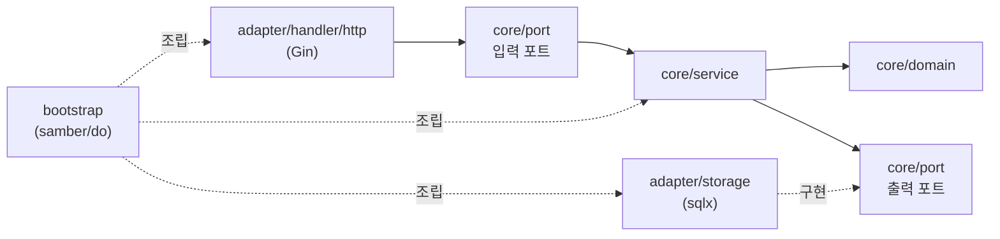

# Backend 아키텍처 가이드 (CLAUDE.md)

이 디렉터리는 **헥사고날 아키텍처(포트 & 어댑터)** 로 구성된 Go(Gin) CMS REST API 이다.
이후 모든 코드 변경은 아래 규칙을 따른다. **레이어 경계와 의존성 방향이 이 코드베이스의 핵심 제약이다.**

## 1. 의존성 방향 (절대 규칙)

의존성은 항상 바깥(어댑터) → 안쪽(코어)으로만 향한다. 코어는 어댑터를 절대 알지 못한다.



- `core/domain` 은 **표준 라이브러리만 import 한다**. gin/sqlx/zap/pkg/errors import 금지. (도메인 에러는 `ConstantError` 라 `errors` 패키지도 불필요)
- `core/service`, `core/port` 는 `core/domain`, 표준 라이브러리, 그리고 에러 래핑용 `github.com/pkg/errors` 만 import 한다. 어댑터 패키지·gin·sqlx·zap import 금지.
- 어댑터(`adapter/*`)끼리 직접 의존하지 않는다. 조립은 `bootstrap` 에서만 한다.
- 위반 여부가 의심되면 `core/` 하위에서 `gin`, `sqlx`, `zap`, `adapter` import 가 있는지 확인할 것.

## 2. 레이어별 책임

| 레이어 | 경로 | 책임 | 금지 |
|--------|------|------|------|
| Domain | `internal/core/domain` | 엔티티, 값 객체, 도메인 에러, 불변식(`Valid()`) | DB/HTTP/JSON 태그, 프레임워크 |
| Port | `internal/core/port` | 입력 포트(Service IF) + 출력 포트(Repository IF), 입출력 DTO | 구현 로직 |
| Service | `internal/core/service` | 유스케이스, 검증, 트랜잭션 경계 의미 결정 | SQL, gin.Context |
| HTTP 어댑터 | `internal/adapter/handler/http` | 요청 바인딩, 응답 직렬화, 에러→상태코드 | 비즈니스 규칙 |
| Storage 어댑터 | `internal/adapter/storage` | sqlx 쿼리, dialect 처리, row↔domain 매핑 | 비즈니스 규칙 |
| Bootstrap | `internal/bootstrap` | samber/do 의존성 등록/조립 | 비즈니스 규칙 |

- **도메인 엔티티에 `json:` / `db:` 태그를 달지 않는다.** HTTP 응답은 `handler/http/dto.go` 의 `*Response` 로, DB 매핑은 `storage/model.go` 의 `*Row` 로 분리한다.
- 서비스는 `gin.Context` 가 아닌 `context.Context` 만 받는다.

## 3. 새 엔티티 / 유스케이스 추가 체크리스트

기능을 추가할 때는 안쪽 → 바깥쪽 순서로 작업한다.

1. `core/domain/<entity>.go` — 엔티티 + 상태 enum + `Valid()` (새 에러 분류가 필요하면 `errors.go` 에 `ConstantError` 추가)
2. `core/port/repository.go` — 출력 포트(Repository IF) 메서드 추가
3. `core/port/service.go` — 입력 포트(Service IF) + `Create*Input`/`Update*Input` DTO 추가
4. `core/service/<entity>_service.go` — 유스케이스 구현 (+ `_test.go` 가짜 리포지토리로 단위 테스트)
5. `storage/model.go` — `<entity>Row` + `toDomain()` 매핑
6. `storage/migrate.go` — **sqlite/postgres 두 스키마 문자열 모두** 에 테이블 추가
7. `storage/<entity>_repository.go` — sqlx 구현. 에러는 `mapError` → `errors.Wrap(.., "작업명")` 로 반환. (`var _ port.XRepository = (*XRepository)(nil)` 로 컴파일 타임 확인)
8. `handler/http/dto.go` — 요청/응답 DTO + 매핑 함수
9. `handler/http/<entity>_handler.go` — 핸들러 + `register(rg)`. 에러는 `respondError`/`respondBadRequest` 로 등록(§6). 새 도메인 에러를 추가했다면 `ginerror.go` 의 `fromDomain` 매핑도 갱신.
10. `handler/http/router.go` — `Handlers` 구조체 및 `NewRouter` 에 등록
11. `bootstrap/container.go` — repo → service → handler 순으로 `do.Provide`, 엔진 provider에 핸들러 연결

## 4. sqlx / dialect 주의사항

기본은 SQLite, 확장 대상은 PostgreSQL 이다. 두 dialect 차이를 코드가 흡수한다.

- **플레이스홀더**: 쿼리는 항상 `?` 로 작성하고 실행 직전 `db.Rebind(q)` 를 호출한다. postgres 에서 `$N` 으로 변환된다. (`?` 를 직접 `$1` 로 쓰지 말 것.)
- **INSERT 후 PK**: 반드시 `insertReturningID(ctx, ext, driver, q, args...)` 헬퍼를 사용한다. sqlite는 `LastInsertId()`, postgres는 `RETURNING id` 로 분기되어 있다.
- **스키마**: `migrate.go` 의 `schemaSQLite` 와 `schemaPostgres` **양쪽 모두** 갱신한다. 한쪽만 바꾸면 다른 dialect에서 런타임 실패한다. (sqlite `INTEGER PRIMARY KEY AUTOINCREMENT` ↔ postgres `BIGSERIAL`, `DATETIME` ↔ `TIMESTAMPTZ`)
- **트랜잭션**: 다중 테이블 쓰기(예: post + post_tags)는 `BeginTxx` → `defer tx.Rollback()` → `tx.Commit()` 패턴. 헬퍼들은 `*sqlx.DB` 와 `*sqlx.Tx` 공통 인터페이스 `ext` 를 받으므로 트랜잭션 안에서도 그대로 쓴다.
- **에러 변환**: 리포지토리는 raw 에러를 그대로 반환하지 말고 `mapError(err)` 를 거친 뒤 `errors.Wrap` 으로 작업 맥락을 덧붙인다 (sql.ErrNoRows→`ErrNotFound`, unique 위반→`ErrConflict`). 신규 제약 위반 패턴이 생기면 `mapError` 에 추가한다. 상세는 §6.
- 운영 마이그레이션은 현재 기동 시 idempotent DDL 로 처리한다. 스키마가 복잡해지면 golang-migrate 등 전용 도구 도입을 검토한다(이때 `migrate.go` 의 역할을 대체).

## 5. 의존성 주입 (samber/do)

- 모든 와이어링은 `bootstrap/container.go` 한 곳에서 한다. 다른 곳에서 `do.New()` 를 호출하지 않는다.
- 출력 포트는 **인터페이스 타입으로 Provide** 한다: `do.Provide(i, func(in)(port.XRepository, error){...})`. 구체 타입으로 등록하면 서비스가 구현에 결합된다.
- 의존성은 provider 안에서 `do.MustInvoke[T](in)` 으로 가져온다.
- 종료가 필요한 리소스(DB 등)는 `do.Provide` 의 provider가 반환한 값에 대해 컨테이너 `Shutdown()` 으로 정리된다. `main.go` 가 시그널 수신 후 `injector.Shutdown()` 을 호출한다.

## 6. 에러 처리 (가장 중요)

> 정식 기준은 **[`../docs/error-handling.md`](../docs/error-handling.md)** (저장소 루트 `docs/`). 아래는 핵심 요약이며, 상세·코드 예시·근거는 문서를 따른다.

핵심 원칙: **에러는 값이다 / 맥락을 덧붙여 전파한다 / 딱 한 번만 처리한다(로그·응답 중복 금지).** (pos-connector 컨벤션 + Dave Cheney 가이드라인)

- **분류**: 도메인 에러는 `domain.ConstantError` sentinel(`core/domain/errors.go`), 식별은 항상 `errors.Is`. 타입 단언/`Error()` 문자열 비교 금지.
- **래핑**: `github.com/pkg/errors` 의 `errors.Wrap(err, "작업명")` 으로 **발생 지점(주로 리포지토리)에서 한 번만** 맥락 부여. 서비스는 하위 에러를 **그대로 전파**(중복 래핑 금지), 자신이 만드는 검증 에러만 `domain.ErrInvalidInput` 직접 반환.
- **HTTP**: 핸들러는 응답을 직접 만들지 않는다 — 도메인 에러는 `respondError(c, err)`, 입력 오류는 `respondBadRequest(c, err)` 로 **등록만** 하고 `return`(성공만 `c.JSON`). 변환은 `ErrorHandle` 미들웨어 한 곳, 상태 매핑은 `ErrorCode.StatusCode()` 한 곳. 새 도메인 에러 추가 시 `ginerror.go` 의 `fromDomain`/`ErrorCode` 갱신.
- **응답 봉투**: `Response{code, status, message, detail}`. `detail` 은 4xx 만, **500 엔 미포함**(내부 상세 유출 방지).
- **로깅**: 하위 레이어는 로깅하지 않는다(반환만). 로깅은 최상단 ginzap 1회. 미들웨어 순서 `Ginzap → RecoveryWithZap → ErrorHandle`.
- **검증 2단계**: 1차 gin `binding` 태그 → `respondBadRequest`, 2차 비즈니스 규칙 → 서비스에서 `domain.ErrInvalidInput`.

## 7. API 네임스페이스: 사용자(public) vs 관리자(admin)

두 인바운드 어댑터가 **같은 코어(서비스/도메인)** 를 공유하되 표현/규약이 다르다.

| 구분 | 베이스 | 패키지 | 직렬화 | 목록 | 에러 바디 | 인증 |
| --- | --- | --- | --- | --- | --- | --- |
| 사용자 | `/api/v1` | `handler/http` | snake_case | `{"data":[...]}` | `Response{code,...}` | 회원 JWT(쓰기/댓글) |
| 관리자 | `/admin/api/v1` | `handler/admin` | **camelCase** | **배열 + `X-Total-Count`** | `{"message":"..."}` | **관리자 JWT + ACL** |

- **공개 API 의 posts/categories/tags 는 읽기 전용(GET)** 이다. 생성/수정/삭제 관리는 관리자 API 에서만. 공개 쓰기는 댓글(로그인 회원)뿐.
- **회원 인증**: 공개 `/api/v1/auth/*`(register/login/refresh 공개, me·logout 보호). 댓글 작성/수정/삭제는 로그인 + **소유권**(본인 댓글만; `CommentService.UpdateOwnedContent`/`DeleteOwned`).
- **토큰 분리**: 회원/관리자 JWT 는 동일 시크릿이나 **audience(`user`/`admin`)로 분리**(`security.AudienceUser`/`AudienceAdmin`). 상호 토큰 사용 불가, refresh↔access 도 `typ` 로 구분.
- 관리자 API 는 refine `@refinedev/simple-rest` 규약을 따른다. FE 계약: `../docs/api.md`·`../docs/user-auth.md`, 머신리더블: `../docs/swagger.json`(관리자 요청) / `docs/swagger.json`(관리자 구현) / `docs/swagger-public.json`(공개 API 구현, FE 공유용).
- 코어 재사용: 관리자 핸들러도 동일한 `port.*Service` 를 주입받는다. 새 표현만 어댑터에 추가하고 비즈니스 로직은 중복 구현하지 않는다.
- 목록 쿼리: `_start/_end`(페이지)·`_sort/_order`(정렬)·`{field}_like`/`{field}`(필터)는 `admin/query.go` 가 `port.ListQuery` 로 파싱 → `service.Query` → `storage` 의 `buildListClauses`. **필터/정렬 필드는 리포지토리의 화이트리스트(`fieldMap`)에만 매핑**(임의 컬럼/SQL 주입 차단). 새 필터·정렬 필드는 해당 리포지토리의 `*FilterCols`/`*SortCols` 에 추가.
- 수정은 `PATCH`(부분): `admin/patch.go` 의 `patcher` 가 본문에 존재하는 키만 덮어쓴다(없으면 기존 값 유지, `null` 은 해제). 검증/`publishedAt`/태그 교체 등은 기존 서비스 `Update` 를 재사용한다.
- `X-Total-Count` 는 모든 목록 응답에 필수(`setTotalCount`). CORS 에서 expose 한다.

## 8. 관리자 인증/인가 (JWT + RBAC)

요청서: `../docs/admin-auth.md`. 핵심: **권한은 서버에서 반드시 강제**(UI 숨김은 편의일 뿐).

- **JWT**: `adapter/security/jwt.go`(golang-jwt v4, HS256). 액세스 토큰 클레임 `sub`(id)·`role`·`email`·`name`. 비밀번호는 bcrypt(`adapter/security/bcrypt.go`).
- **흐름**: `/admin/api/v1/auth/login`·`/auth/refresh` 는 공개, 그 외는 `Authenticate` 미들웨어가 Bearer 토큰을 검증해 신원을 컨텍스트에 적재. `/auth/me`·`/auth/logout` 및 CRUD 는 보호.
- **RBAC**: 권한은 `domain.Role.Permissions()`(역할→`resource:action` 매트릭스)에서 파생. **역할 정의의 source of truth 는 BE**. 각 CRUD 라우트에 `RequirePermission(resource, action)` 적용. `superadmin` 우회(`AdminUser.Can`).
- **상태코드**: 토큰 누락·만료·무효 → **401**(`domain.ErrUnauthorized`), 권한 부족 → **403**(`domain.ErrForbidden`). `admin/errors.go` 의 `classify` 가 매핑. 새 도메인 에러 추가 시 classify 갱신.
- **사용자 저장소**: `admin_users` 테이블(`storage/admin_user_repository.go`). 비어있으면 `SeedDefaultAdmins` 가 개발용 계정(admin/editor/viewer, env `ADMIN_SEED_PASSWORD`)을 시드 — **운영 전 반드시 교체**.
- **설정**: `JWT_SECRET`(운영 필수 교체), `JWT_ACCESS_TTL_MIN`, `JWT_REFRESH_TTL_HOURS`, `CORS_ALLOW_ORIGINS`.
- 권한 매트릭스나 토큰 클레임을 바꾸면 `domain/admin_user.go` 와 `docs/swagger.json`(공유 사양)을 함께 갱신한다.

## 9. 의존성 버전 정책

새 라이브러리 도입이나 버전 결정이 필요하면, 가능한 한 사내 `pos-connector` 프로젝트(`~/payhereinc/@pos-connector/main`)의 선택을 우선한다. (현재: gin v1.9.1, samber/do v1.6.0, sqlx, lib/pq, zap, gin-contrib/zap, gin-contrib/cors v1.4.0, golang-jwt/jwt v4, pkg/errors v0.9.1, x/crypto bcrypt)

## 10. 명령어

```bash
make run     # 개발 서버 (기본 :8080, sqlite cms.db)
make build   # bin/api 빌드
make test    # 테스트 (코어는 DB 없이 가짜 리포지토리로 검증)
make vet     # 정적 분석
make tidy    # go mod tidy
```

변경 후에는 최소 `go build ./... && go vet ./... && go test ./...` 를 통과시킨다. 코어 로직 변경 시 `core/service` 에 단위 테스트를 함께 추가/갱신한다.
