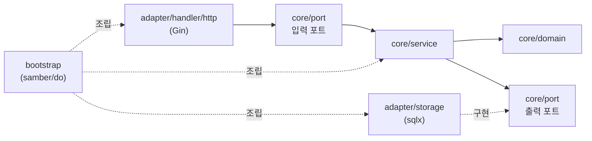
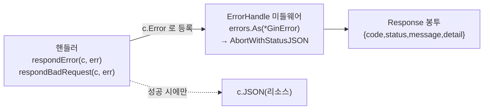

# Backend 아키텍처 가이드 (CLAUDE.md)

이 디렉터리는 **헥사고날 아키텍처(포트 & 어댑터)** 로 구성된 Go(Gin) CMS REST API 이다.
이후 모든 코드 변경은 아래 규칙을 따른다. **레이어 경계와 의존성 방향이 이 코드베이스의 핵심 제약이다.**

## 1. 의존성 방향 (절대 규칙)

의존성은 항상 바깥(어댑터) → 안쪽(코어)으로만 향한다. 코어는 어댑터를 절대 알지 못한다.



- `core/domain` 은 **표준 라이브러리만 import 한다**. gin/sqlx/zap/pkg/errors import 금지. (도메인 에러는 `ConstantError` 라 `errors` 패키지도 불필요)
- `core/service`, `core/port` 는 `core/domain`, 표준 라이브러리, 그리고 에러 래핑용 `github.com/pkg/errors` 만 import 한다. 어댑터 패키지·gin·sqlx·zap import 금지.
- 어댑터(`adapter/*`)끼리 직접 의존하지 않는다. 조립은 `bootstrap` 에서만 한다.
- 위반 여부가 의심되면 `core/` 하위에서 `gin`, `sqlx`, `zap`, `adapter` import 가 있는지 확인할 것.

## 2. 레이어별 책임

| 레이어 | 경로 | 책임 | 금지 |
|--------|------|------|------|
| Domain | `internal/core/domain` | 엔티티, 값 객체, 도메인 에러, 불변식(`Valid()`) | DB/HTTP/JSON 태그, 프레임워크 |
| Port | `internal/core/port` | 입력 포트(Service IF) + 출력 포트(Repository IF), 입출력 DTO | 구현 로직 |
| Service | `internal/core/service` | 유스케이스, 검증, 트랜잭션 경계 의미 결정 | SQL, gin.Context |
| HTTP 어댑터 | `internal/adapter/handler/http` | 요청 바인딩, 응답 직렬화, 에러→상태코드 | 비즈니스 규칙 |
| Storage 어댑터 | `internal/adapter/storage` | sqlx 쿼리, dialect 처리, row↔domain 매핑 | 비즈니스 규칙 |
| Bootstrap | `internal/bootstrap` | samber/do 의존성 등록/조립 | 비즈니스 규칙 |

- **도메인 엔티티에 `json:` / `db:` 태그를 달지 않는다.** HTTP 응답은 `handler/http/dto.go` 의 `*Response` 로, DB 매핑은 `storage/model.go` 의 `*Row` 로 분리한다.
- 서비스는 `gin.Context` 가 아닌 `context.Context` 만 받는다.

## 3. 새 엔티티 / 유스케이스 추가 체크리스트

기능을 추가할 때는 안쪽 → 바깥쪽 순서로 작업한다.

1. `core/domain/<entity>.go` — 엔티티 + 상태 enum + `Valid()` (새 에러 분류가 필요하면 `errors.go` 에 `ConstantError` 추가)
2. `core/port/repository.go` — 출력 포트(Repository IF) 메서드 추가
3. `core/port/service.go` — 입력 포트(Service IF) + `Create*Input`/`Update*Input` DTO 추가
4. `core/service/<entity>_service.go` — 유스케이스 구현 (+ `_test.go` 가짜 리포지토리로 단위 테스트)
5. `storage/model.go` — `<entity>Row` + `toDomain()` 매핑
6. `storage/migrate.go` — **sqlite/postgres 두 스키마 문자열 모두** 에 테이블 추가
7. `storage/<entity>_repository.go` — sqlx 구현. 에러는 `mapError` → `errors.Wrap(.., "작업명")` 로 반환. (`var _ port.XRepository = (*XRepository)(nil)` 로 컴파일 타임 확인)
8. `handler/http/dto.go` — 요청/응답 DTO + 매핑 함수
9. `handler/http/<entity>_handler.go` — 핸들러 + `register(rg)`. 에러는 `respondError`/`respondBadRequest` 로 등록(§6). 새 도메인 에러를 추가했다면 `ginerror.go` 의 `fromDomain` 매핑도 갱신.
10. `handler/http/router.go` — `Handlers` 구조체 및 `NewRouter` 에 등록
11. `bootstrap/container.go` — repo → service → handler 순으로 `do.Provide`, 엔진 provider에 핸들러 연결

## 4. sqlx / dialect 주의사항

기본은 SQLite, 확장 대상은 PostgreSQL 이다. 두 dialect 차이를 코드가 흡수한다.

- **플레이스홀더**: 쿼리는 항상 `?` 로 작성하고 실행 직전 `db.Rebind(q)` 를 호출한다. postgres 에서 `$N` 으로 변환된다. (`?` 를 직접 `$1` 로 쓰지 말 것.)
- **INSERT 후 PK**: 반드시 `insertReturningID(ctx, ext, driver, q, args...)` 헬퍼를 사용한다. sqlite는 `LastInsertId()`, postgres는 `RETURNING id` 로 분기되어 있다.
- **스키마**: `migrate.go` 의 `schemaSQLite` 와 `schemaPostgres` **양쪽 모두** 갱신한다. 한쪽만 바꾸면 다른 dialect에서 런타임 실패한다. (sqlite `INTEGER PRIMARY KEY AUTOINCREMENT` ↔ postgres `BIGSERIAL`, `DATETIME` ↔ `TIMESTAMPTZ`)
- **트랜잭션**: 다중 테이블 쓰기(예: post + post_tags)는 `BeginTxx` → `defer tx.Rollback()` → `tx.Commit()` 패턴. 헬퍼들은 `*sqlx.DB` 와 `*sqlx.Tx` 공통 인터페이스 `ext` 를 받으므로 트랜잭션 안에서도 그대로 쓴다.
- **에러 변환**: 리포지토리는 raw 에러를 그대로 반환하지 말고 `mapError(err)` 를 거친 뒤 `errors.Wrap` 으로 작업 맥락을 덧붙인다 (sql.ErrNoRows→`ErrNotFound`, unique 위반→`ErrConflict`). 신규 제약 위반 패턴이 생기면 `mapError` 에 추가한다. 상세는 §6.
- 운영 마이그레이션은 현재 기동 시 idempotent DDL 로 처리한다. 스키마가 복잡해지면 golang-migrate 등 전용 도구 도입을 검토한다(이때 `migrate.go` 의 역할을 대체).

## 5. 의존성 주입 (samber/do)

- 모든 와이어링은 `bootstrap/container.go` 한 곳에서 한다. 다른 곳에서 `do.New()` 를 호출하지 않는다.
- 출력 포트는 **인터페이스 타입으로 Provide** 한다: `do.Provide(i, func(in)(port.XRepository, error){...})`. 구체 타입으로 등록하면 서비스가 구현에 결합된다.
- 의존성은 provider 안에서 `do.MustInvoke[T](in)` 으로 가져온다.
- 종료가 필요한 리소스(DB 등)는 `do.Provide` 의 provider가 반환한 값에 대해 컨테이너 `Shutdown()` 으로 정리된다. `main.go` 가 시그널 수신 후 `injector.Shutdown()` 을 호출한다.

## 6. 에러 처리 (가장 중요)

사내 `pos-connector` 컨벤션과 Dave Cheney 의 "Don't just check errors, handle them gracefully" 가이드라인을 따른다.
핵심 원칙: **에러는 값이다 / 맥락을 덧붙여 전파한다 / 딱 한 번만 처리한다(로그와 응답을 중복하지 않는다).**

### 6.1 에러의 생성과 전파

- **도메인 에러는 `domain.ConstantError` sentinel** (`core/domain/errors.go`). 식별은 항상 `errors.Is` 로 한다. 타입 단언/`Error()` 문자열 비교 금지.
- **래핑은 `github.com/pkg/errors`** 의 `errors.Wrap(err, "작업명")` / `errors.Wrapf(...)` 로 한다. 표준 `%w` 대신 pkg/errors 로 통일(pos-connector 와 동일). `errors.Is/As` 는 pkg/errors 가 재노출하므로 같은 패키지에서 그대로 쓴다.
- **맥락은 발생 지점(주로 리포지토리)에서 한 번만** 덧붙인다. 서비스는 리포지토리 에러를 **그대로 전파**한다(중복 래핑 금지 → `"수정: 수정: ..."` 방지). 서비스가 새로 만드는 검증 에러만 `domain.ErrInvalidInput` 등을 직접 반환한다.
- **로그하면서 동시에 return 하지 않는다.** 하위 레이어(service/storage)는 절대 로깅하지 않고 에러를 반환만 한다. 로깅은 최상단(ginzap)에서 한 번 일어난다.

### 6.2 HTTP 응답 파이프라인 (핸들러는 응답을 직접 만들지 않는다)



- 핸들러는 에러를 **등록만** 한다: 도메인 에러는 `respondError(c, err)`, 바인딩/파싱 등 입력 오류는 `respondBadRequest(c, err)`. 호출 직후 `return`. **핸들러에서 `c.JSON` 으로 에러를 직접 쓰지 않는다**(성공 응답에만 `c.JSON` 사용).
- `respondError` → `fromDomain(err)` 가 `errors.Is` 로 도메인 sentinel 을 `ErrorCode` 로 매핑한다. **새 도메인 에러를 추가하면 `ginerror.go` 의 `fromDomain` 과 `ErrorCode`(+`StatusCode()`/`Message()`)도 갱신**한다.
- 실제 HTTP 응답 생성은 **오직 `ErrorHandle` 미들웨어 한 곳**에서 일어난다(`middleware.go`). HTTP 상태코드 매핑은 **`ErrorCode.StatusCode()` 한 곳**에 집중한다.
- 에러 응답 봉투는 `Response{code, status, message, detail}`. `message` 는 사용자 노출용 안전 문구, `detail` 은 4xx 에 한해 디버깅용 원본 문자열. **500(`ErrInternal`)에는 `detail` 을 넣지 않는다**(내부/SQL 상세 유출 방지).
- 경로 파라미터 정수 파싱은 `parseIDParam(c, "id")`.
- 성공 응답 컨벤션: 목록은 `{"data": [...]}`, 단건은 리소스 객체 직접 반환. (성공 응답까지 `Response` 봉투로 통일하려면 별도 결정 후 일괄 적용.)

### 6.3 로깅 / panic

- 미들웨어 순서는 `Ginzap → RecoveryWithZap → ErrorHandle` 로 등록한다. 후처리는 역순이라 ErrorHandle 이 응답을 만든 뒤 Ginzap 이 최종 상태/에러를 로깅한다(응답=ErrorHandle, 로깅=Ginzap 으로 분리).
- panic 복구는 `ginzap.RecoveryWithZap` 을 그대로 쓴다(커스텀 recover 만들지 않음).
- 참고: 현재 ginzap 기본 설정은 4xx 클라이언트 오류도 error 레벨 + stacktrace 로 남긴다. 로그 노이즈가 문제되면 상태코드별 레벨을 조정하는 커스텀 로깅 미들웨어 도입을 검토한다.

### 6.4 요청 검증 2단계

1차는 핸들러에서 gin `binding` 태그(`required` 등) → 실패 시 `respondBadRequest`. 2차(비즈니스 규칙)는 서비스에서 `domain.ErrInvalidInput` 반환.

## 7. 의존성 버전 정책

새 라이브러리 도입이나 버전 결정이 필요하면, 가능한 한 사내 `pos-connector` 프로젝트(`~/payhereinc/@pos-connector/main`)의 선택을 우선한다. (현재: gin v1.9.1, samber/do v1.6.0, sqlx, lib/pq, zap, gin-contrib/zap, pkg/errors v0.9.1)

## 8. 명령어

```bash
make run     # 개발 서버 (기본 :8080, sqlite cms.db)
make build   # bin/api 빌드
make test    # 테스트 (코어는 DB 없이 가짜 리포지토리로 검증)
make vet     # 정적 분석
make tidy    # go mod tidy
```

변경 후에는 최소 `go build ./... && go vet ./... && go test ./...` 를 통과시킨다. 코어 로직 변경 시 `core/service` 에 단위 테스트를 함께 추가/갱신한다.
