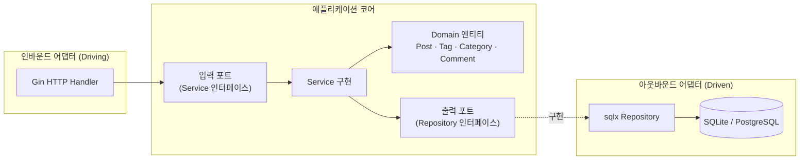

# Refine CMS Backend

Go(Gin) 기반 CMS REST API. **헥사고날 아키텍처(포트 & 어댑터)** 로 구성되어 있으며,
기본 저장소는 SQLite 이고 PostgreSQL 로 손쉽게 교체할 수 있습니다.

## 아키텍처



- **Domain** (`internal/core/domain`): 순수 비즈니스 엔티티. 프레임워크/DB 의존성 없음.
- **Port** (`internal/core/port`): 입력 포트(Service)와 출력 포트(Repository) 인터페이스.
- **Service** (`internal/core/service`): 유스케이스 구현. 출력 포트에만 의존.
- **Adapter** (`internal/adapter`): Gin HTTP(인바운드), sqlx 영속성(아웃바운드).
- **Bootstrap** (`internal/bootstrap`): `samber/do` 기반 의존성 주입 컨테이너.

의존성은 항상 바깥에서 안쪽(코어)으로 향합니다. 코어는 어댑터를 알지 못합니다.
DI 컨테이너가 출력 포트(`port.*Repository`)에 sqlx 구현을 바인딩하므로,
PostgreSQL 전환이나 리포지토리 교체 시 코어 코드는 변경되지 않습니다.

## 디렉터리 구조

```
backend/
├── cmd/api/main.go              # 부트스트랩 + graceful shutdown
├── internal/
│   ├── config/                  # 환경설정 로딩
│   ├── bootstrap/               # samber/do DI 컨테이너
│   ├── core/
│   │   ├── domain/              # 엔티티 + 도메인 에러
│   │   ├── port/               # 입력/출력 포트 인터페이스
│   │   └── service/            # 유스케이스 구현
│   └── adapter/
│       ├── handler/http/       # Gin 라우터 & 핸들러
│       └── storage/            # sqlx 리포지토리 (sqlite/postgres dialect)
└── ...
```

## 실행

```bash
cp .env.example .env
make tidy
make run
```

기본적으로 `http://localhost:8080` 에서 서비스되며 `cms.db` SQLite 파일이 생성됩니다.

## PostgreSQL 로 전환

`.env` 만 수정하면 됩니다 (코드 변경 불필요):

```env
DB_DRIVER=postgres
DB_DSN=host=localhost user=cms password=cms dbname=cms port=5432 sslmode=disable
```

`internal/adapter/storage/db.go` 의 드라이버 분기에서 연결을 선택하고,
`migrate.go` 가 dialect 에 맞는 DDL(BIGSERIAL/TIMESTAMPTZ 등)을 적용합니다.
쿼리는 `?` 플레이스홀더로 작성한 뒤 `Rebind` 으로 postgres 의 `$N` 으로 변환합니다.

## API 엔드포인트

베이스 경로: `/api/v1`

| 리소스 | 메서드 & 경로 |
|--------|--------------|
| Health | `GET /healthz` |
| Posts | `GET/POST /posts`, `GET/PUT/DELETE /posts/:id` |
| Categories | `GET/POST /categories`, `GET/PUT/DELETE /categories/:id` |
| Tags | `GET/POST /tags`, `GET/PUT/DELETE /tags/:id` |
| Comments | `POST /comments`, `GET/PUT/DELETE /comments/:id`, `GET /posts/:id/comments` |
