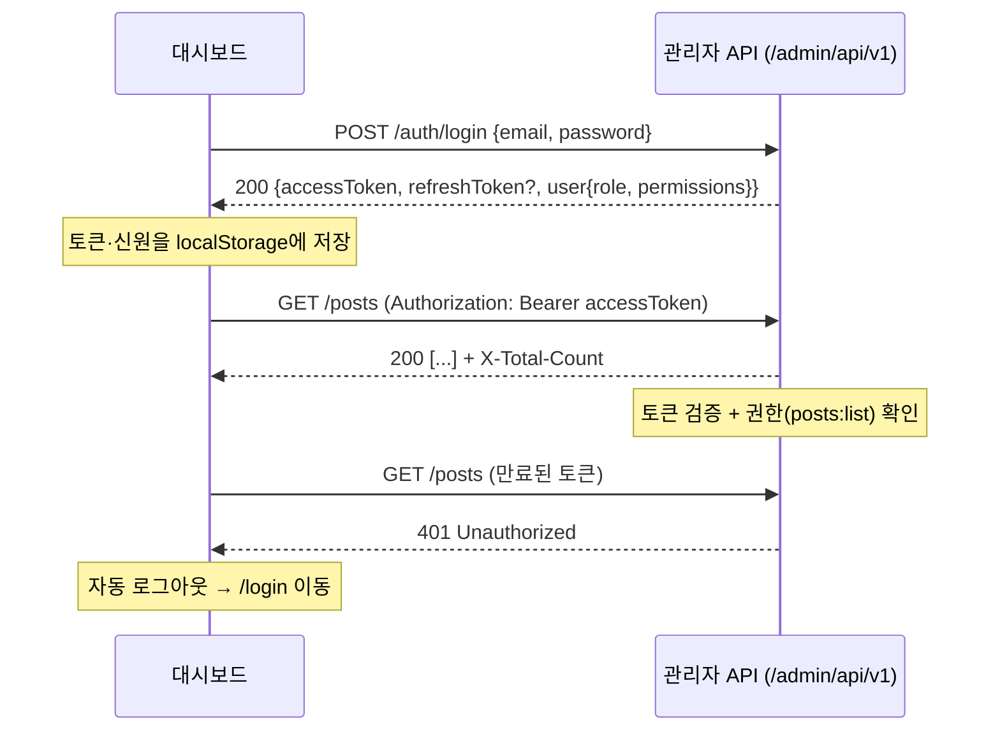

# 관리자 인증·권한(ACL) API 요청서 (백엔드 전달용)

관리자 대시보드(`frontend/apps/dashboard/`)에 **로그인 인증**과 **ACL(역할 기반 권한)** 을 추가했다.
이를 지원하기 위해 백엔드에 아래 인증 엔드포인트와 권한 모델을 구현해 달라는 요청서다.

- 모든 관리자 인증 엔드포인트는 관리자 API 네임스페이스 **`/admin/api/v1/auth/*`** 아래에 둔다(사용자용 `/api/v1`과 분리).
- 인증 방식: **JWT Bearer 토큰**. 발급된 액세스 토큰을 모든 관리자 API 요청에 `Authorization: Bearer <accessToken>` 헤더로 전달한다.
- 권한 모델: **RBAC** — 사용자별 `role` + `permissions: string[]`(`resource:action`).
- 머신리더블 스펙은 [`swagger.json`](./swagger.json)의 `auth` 태그 / `bearerAuth` 스킴 참조.

---

## 1. 인증 흐름



---

## 2. 엔드포인트

베이스: `http://localhost:9000/admin/api/v1`

| 메서드 | 경로 | 인증 | 설명 |
| --- | --- | --- | --- |
| POST | `/auth/login` | 불필요 | 이메일/비밀번호 로그인, 토큰+신원 반환 |
| GET | `/auth/me` | Bearer | 현재 토큰의 관리자 신원(역할·권한) |
| POST | `/auth/refresh` | 리프레시 토큰 | 액세스 토큰 갱신(선택 구현) |
| POST | `/auth/logout` | Bearer | 서버 측 토큰 무효화(선택) |

### 2.1 `POST /auth/login`
요청:
```json
{ "email": "admin@example.com", "password": "secret" }
```
응답 200:
```json
{
  "accessToken": "<JWT>",
  "refreshToken": "<optional>",
  "user": {
    "id": 1,
    "name": "관리자",
    "email": "admin@example.com",
    "role": "editor",
    "permissions": ["posts:list", "posts:show", "posts:create", "posts:edit", "comments:list", "comments:edit"]
  }
}
```
실패 401: `{ "message": "이메일 또는 비밀번호가 올바르지 않습니다." }`

### 2.2 `GET /auth/me`
응답 200: `AdminUser`(위 `user`와 동일 구조). 토큰 무효 시 401.
> 대시보드는 로그인 시 받은 `user`를 캐시하지만, 토큰만 있고 신원이 없을 때 이 엔드포인트로 복구할 수 있어야 한다.

### 2.3 `POST /auth/refresh` (선택)
요청 `{ "refreshToken": "..." }` → 응답 `{ "accessToken": "...", "refreshToken": "..." }`.
현재 대시보드는 401 시 **즉시 로그아웃**으로 처리하므로 필수는 아니다. 무중단 세션이 필요해지면 사용한다.

### 2.4 `POST /auth/logout` (선택)
서버 측 토큰/리프레시 토큰 폐기. 대시보드는 응답과 무관하게 로컬 토큰을 폐기한다.

---

## 3. 데이터 모델 — `AdminUser`

| 필드 | 타입 | 설명 |
| --- | --- | --- |
| `id` | integer | 관리자 ID |
| `name` | string | 표시 이름 |
| `email` | string | 로그인 이메일 |
| `role` | string | 역할. `superadmin`은 전체 권한(ACL 우회) |
| `permissions` | string[] | `resource:action` 권한 문자열 목록 |
| `avatar` | string? | 아바타 URL(선택) |

### 권한 문자열 포맷: `resource:action`
- `resource` ∈ `posts` · `categories` · `tags` · `comments`
- `action` ∈ `list` · `show` · `create` · `edit` · `delete`
- 예: `posts:create`, `comments:delete`

대시보드는 이 목록으로 메뉴/버튼/행 액션 노출을 제어한다(`role === "superadmin"`이면 전부 허용).

### 역할 → 권한 매트릭스(권장 기본값)
BE가 역할 정의의 소스 오브 트루스다. 아래는 권장 예시이며, 응답에는 항상 **펼쳐진 `permissions` 배열**을 함께 내려준다.

| 역할 | 권한 |
| --- | --- |
| `superadmin` | 전체(권한 검사 우회) |
| `editor` | 모든 리소스 `list/show/create/edit` (+ `comments:delete`) |
| `viewer` | 모든 리소스 `list/show` 만 |

---

## 4. 백엔드 구현 시 필수 사항

1. **권한은 서버에서 반드시 강제한다(심층 방어).** 대시보드의 UI 숨김은 편의일 뿐이며, 모든 관리자 엔드포인트에서 토큰·권한을 검증해야 한다.
   - 토큰 없음/만료/무효 → **401**
   - 토큰은 유효하나 권한 부족 → **403**
   - 대시보드는 401/403을 받으면 로그아웃 후 `/login`으로 보낸다.
2. **`/admin/api/v1` 전체에 관리자 인증 미들웨어**를 적용한다(단, `/auth/login`·`/auth/refresh`는 예외).
3. 비밀번호는 **bcrypt 등으로 해시** 저장. 로그인 브루트포스 방지를 위한 **레이트 리밋** 권장.
4. JWT 액세스 토큰에 권장 만료(예: 15~60분) 설정, `sub`(관리자 id)와 `role` 클레임 포함. 리프레시 토큰 사용 시 회전(rotation) 권장.
5. **CORS**: 대시보드 출처 허용 + `Authorization` 요청 헤더 허용(`Access-Control-Allow-Headers`) + 목록용 `Access-Control-Expose-Headers: X-Total-Count` 유지.
6. 권한 검사 매핑: 대시보드는 refine 액션을 `list/show/create/edit/delete`로 보낸다(`clone`은 `create`로 취급). BE의 엔드포인트별 요구 권한과 일치시킨다.

---

## 5. 대시보드 측 동작 요약(참고)

- 로그인 성공 시 `accessToken`(+`refreshToken`)과 `user`를 localStorage에 저장하고, 모든 관리자 API 요청에 Bearer 헤더를 주입한다.
- 미인증 상태에서 보호 라우트 접근 시 `/login`으로 리다이렉트한다.
- 사이드바 메뉴는 `{resource}:list`, 생성 버튼은 `{resource}:create`, 행의 상세/수정/삭제는 각각 `show/edit/delete` 권한으로 노출을 제어한다.
- 관련 구현: `frontend/apps/dashboard/src/shared/api/{auth-provider,access-control-provider,http-client,session}.ts`, `src/pages/login/`.
