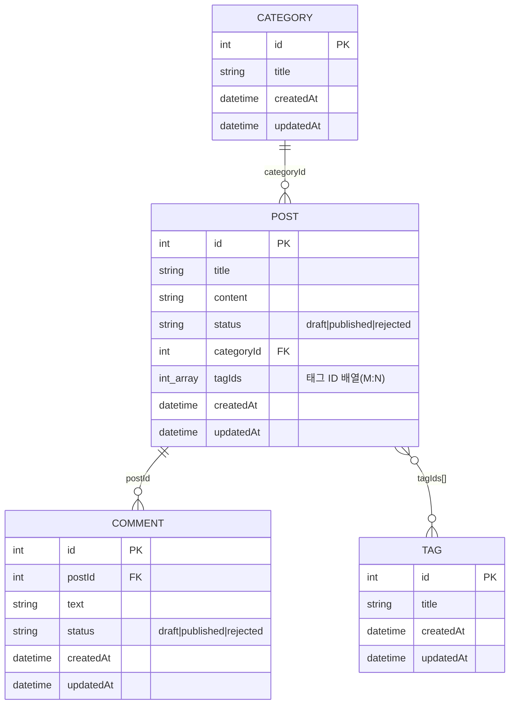

# CMS Dashboard API 명세 (백엔드 전달용)

이 문서는 `dashboard/`(refine 기반 어드민)가 호출하는 백엔드 REST API 규약을 정의한다.
백엔드(Go)는 아직 구현 전이며, 이 문서와 [`swagger.json`](./swagger.json)을 기준으로 구현한다.

- **API 호스트(개발)**: `http://localhost:9000`
- **데이터 프로바이더**: [`@refinedev/simple-rest`](https://refine.dev/docs/data/packages/simple-rest/) — json-server 스타일 규약
- 대시보드의 `VITE_API_URL` 환경변수로 호스트를 덮어쓸 수 있다(기본값 `http://localhost:9000`).

---

## 1. 리소스와 데이터 모델



| 리소스 | 경로 | 설명 |
| --- | --- | --- |
| posts | `/posts` | 게시글. `categoryId`(N:1), `tagIds`(M:N) 보유 |
| categories | `/categories` | 카테고리 |
| tags | `/tags` | 태그 |
| comments | `/comments` | 댓글. `postId`(N:1) 보유 |

> `status` enum 값은 `draft`(초안/대기), `published`(게시/승인), `rejected`(반려/거부)로 posts·comments에서 공통 사용한다.

---

## 2. refine ↔ HTTP 매핑

`@refinedev/simple-rest`는 리소스별로 아래 엔드포인트를 호출한다.

| refine 동작 | HTTP 요청 | 비고 |
| --- | --- | --- |
| `getList` | `GET /{resource}?_start=&_end=&_sort=&_order=&{filters}` | **응답에 `X-Total-Count` 헤더 필수** |
| `getOne` | `GET /{resource}/{id}` | |
| `getMany` | `GET /{resource}/{id}` × N | simple-rest는 전용 엔드포인트 없이 id 개수만큼 `getOne` 호출 |
| `create` | `POST /{resource}` | 생성된 리소스(또는 `id` 포함 객체) 반환 |
| `update` | `PATCH /{resource}/{id}` | 부분 수정 |
| `deleteOne` | `DELETE /{resource}/{id}` | |

### 2.1 페이지네이션

- `_start`: 시작 offset(포함), `_end`: 끝 offset(미포함).
- 예: 1페이지(10개) → `_start=0&_end=10`, 2페이지 → `_start=10&_end=20`.
- 응답 본문은 **배열**이고, 필터 적용 후 전체 개수를 **`X-Total-Count` 응답 헤더**로 내려준다. 이 헤더가 없으면 대시보드가 페이지 수를 계산하지 못한다.

### 2.2 정렬

- `_sort`: 정렬 필드(콤마로 다중 지정), `_order`: 방향(`asc`/`desc`, `_sort`와 1:1 대응).
- 예: `?_sort=createdAt,id&_order=desc,asc`

### 2.3 필터

simple-rest의 연산자 → 쿼리 파라미터 매핑:

| refine 연산자 | 쿼리 파라미터 | 의미 |
| --- | --- | --- |
| `eq` | `{field}={value}` | 정확히 일치 |
| `ne` | `{field}_ne={value}` | 불일치 |
| `lt` / `lte` | `{field}_lt=` / `{field}_lte=` | 미만 / 이하 |
| `gt` / `gte` | `{field}_gt=` / `{field}_gte=` | 초과 / 이상 |
| `contains` | `{field}_like={value}` | 부분 일치(대소문자 무시 권장) |

예: `GET /posts?status=published&title_like=공지&_start=0&_end=10&_sort=id&_order=desc`

---

## 3. 구현 시 주의사항

1. **`X-Total-Count` 헤더는 모든 목록(`GET /{resource}`) 응답에 포함**해야 한다.
2. **CORS**: 대시보드(예: `http://localhost:5173`)와 API(`http://localhost:9000`)의 출처가 다르므로,
   - 프리플라이트(`OPTIONS`) 허용
   - `Access-Control-Allow-Origin` 설정
   - **`Access-Control-Expose-Headers: X-Total-Count`** 설정 (없으면 브라우저가 헤더를 못 읽음)
3. **수정은 `PATCH`** 를 사용한다. `PUT`만 구현하면 수정이 동작하지 않는다.
4. `id`는 정수(auto-increment) 기준으로 설계했다. UUID 등을 쓰려면 대시보드 엔티티 타입(`dashboard/src/entities/*`)도 함께 조정해야 한다.
5. `createdAt`/`updatedAt`은 서버에서 ISO 8601(`date-time`) 문자열로 채워 응답한다.
6. `posts.tagIds`는 정수 배열로 주고받는다(M:N 매핑 테이블은 BE 내부 구현 자유).

---

## 4. 요청/응답 예시

### 목록 조회

```http
GET /posts?_start=0&_end=10&_sort=id&_order=desc&status=published HTTP/1.1
Host: localhost:9000
```

```http
HTTP/1.1 200 OK
X-Total-Count: 42
Content-Type: application/json

[
  {
    "id": 1,
    "title": "첫 번째 게시글",
    "content": "본문 내용",
    "status": "published",
    "categoryId": 2,
    "tagIds": [1, 3],
    "createdAt": "2026-06-04T05:00:00Z",
    "updatedAt": "2026-06-04T05:00:00Z"
  }
]
```

### 생성

```http
POST /posts HTTP/1.1
Content-Type: application/json

{ "title": "새 글", "content": "내용", "status": "draft", "categoryId": 2, "tagIds": [1] }
```

```http
HTTP/1.1 201 Created
Content-Type: application/json

{ "id": 43, "title": "새 글", "content": "내용", "status": "draft", "categoryId": 2, "tagIds": [1], "createdAt": "...", "updatedAt": "..." }
```

### 수정 (부분)

```http
PATCH /posts/43 HTTP/1.1
Content-Type: application/json

{ "status": "published" }
```

### 삭제

```http
DELETE /posts/43 HTTP/1.1
```

---

## 5. 전체 스펙

머신리더블 스펙은 [`swagger.json`](./swagger.json)(OpenAPI 3.0.3)을 참조한다.
Swagger UI / Redoc 등에 그대로 로드할 수 있다.
