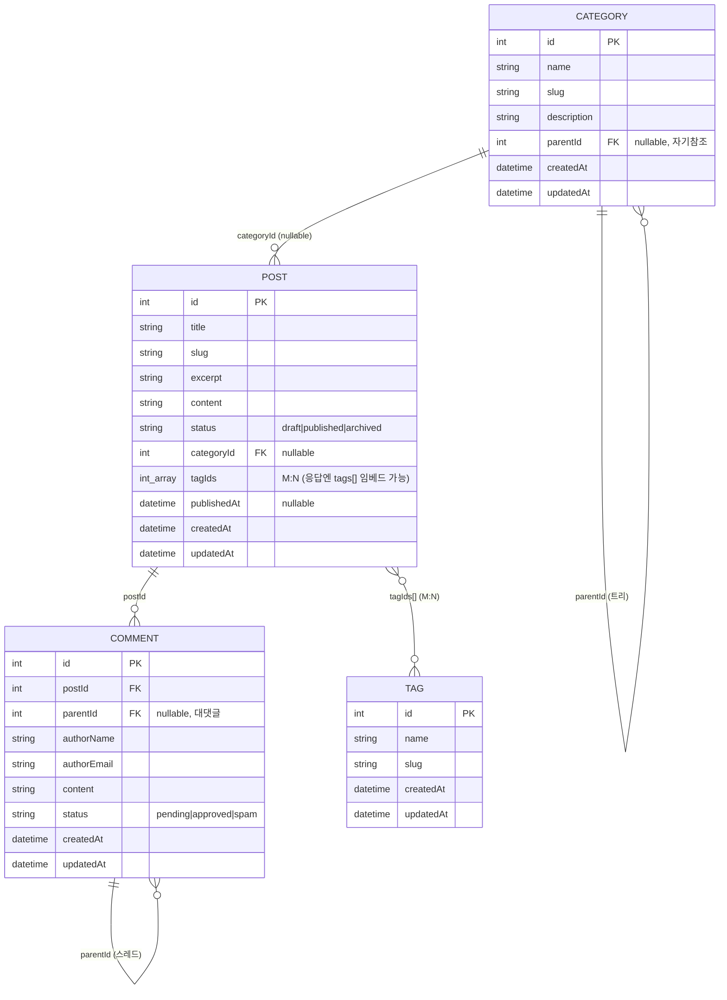

# CMS Admin API 명세 (백엔드 전달용)

이 문서는 **관리자 대시보드**(`frontend/apps/dashboard/`, refine 기반)가 호출하는 **관리자(admin) 전용 API** 규약을 정의한다.
백엔드(Go·Gin·헥사고날, `backend/`)는 사용자용 API를 이미 갖고 있으므로, 아래의 관리자 API를 **별도 네임스페이스로 추가**하면 된다.

## API 네임스페이스 분리

| 구분 | 베이스 경로 | 용도 | 규약 |
| --- | --- | --- | --- |
| 사용자(public) API | `/api/v1` | 프론트/공개 소비 | 기존 백엔드 컨벤션(`{ "data": [...] }` 등). **본 문서 범위 밖** |
| **관리자(admin) API** | **`/admin/api/v1`** | 대시보드 전용 CRUD | refine `simple-rest`(아래 §2). **본 문서가 정의** |

- 관리자 API는 **관리자 인증·인가**를 별도로 적용하는 것을 전제로 한다(미들웨어 그룹 분리).
- 대시보드의 베이스 URL은 `http://localhost:9000/admin/api/v1` (env `VITE_API_URL`로 변경 가능).
- 데이터 프로바이더: [`@refinedev/simple-rest`](https://refine.dev/docs/data/packages/simple-rest/).

---

## 1. 리소스와 데이터 모델



| 리소스 | 경로(admin) | 설명 |
| --- | --- | --- |
| posts | `/admin/api/v1/posts` | 게시글. `categoryId`(N:1, nullable), `tagIds`(M:N) |
| categories | `/admin/api/v1/categories` | 카테고리. `parentId`로 트리 구조 |
| tags | `/admin/api/v1/tags` | 태그 |
| comments | `/admin/api/v1/comments` | 댓글. `postId`(N:1), `parentId`로 대댓글 스레드 |

상태값(enum):
- `Post.status`: `draft`(초안) · `published`(게시됨) · `archived`(보관됨)
- `Comment.status`: `pending`(대기) · `approved`(승인) · `spam`(스팸)

> 이 모델은 백엔드 도메인(`backend/internal/core/domain`)의 풍부한 설계(slug·excerpt·카테고리 트리·댓글 스레드·publishedAt)를 그대로 반영하되, 관리자 API 표현은 **camelCase + simple-rest 규약**으로 노출한다.

---

## 2. refine ↔ HTTP 매핑 (`@refinedev/simple-rest`)

| refine 동작 | HTTP 요청 (admin 베이스 기준) | 비고 |
| --- | --- | --- |
| `getList` | `GET /{resource}?_start=&_end=&_sort=&_order=&{filters}` | **응답에 `X-Total-Count` 헤더 필수** |
| `getOne` | `GET /{resource}/{id}` | |
| `getMany` | `GET /{resource}/{id}` × N | 전용 엔드포인트 없이 id 개수만큼 `getOne` 호출 |
| `create` | `POST /{resource}` | 생성된 리소스 반환(201) |
| `update` | `PATCH /{resource}/{id}` | 부분 수정 |
| `deleteOne` | `DELETE /{resource}/{id}` | 200 응답 |

### 2.1 페이지네이션
- `_start`: 시작 offset(포함), `_end`: 끝 offset(미포함). 예: 1페이지(10개) → `_start=0&_end=10`.
- 응답 본문은 **배열**, 필터 적용 후 전체 개수를 **`X-Total-Count` 응답 헤더**로 내려준다(없으면 페이지 수 계산 불가).

### 2.2 정렬
- `_sort`(필드, 콤마 다중), `_order`(`asc`/`desc`, `_sort`와 1:1). 예: `?_sort=createdAt,id&_order=desc,asc`.

### 2.3 필터 (연산자 → 쿼리 파라미터)

| 연산자 | 쿼리 파라미터 | 의미 |
| --- | --- | --- |
| `eq` | `{field}={value}` | 정확히 일치 |
| `ne` | `{field}_ne=` | 불일치 |
| `lt` / `lte` | `{field}_lt=` / `{field}_lte=` | 미만 / 이하 |
| `gt` / `gte` | `{field}_gt=` / `{field}_gte=` | 초과 / 이상 |
| `contains` | `{field}_like=` | 부분 일치(대소문자 무시 권장) |

리소스별 대표 필터: posts(`title_like`, `status`, `categoryId`), categories(`name_like`, `parentId`), tags(`name_like`), comments(`postId`, `status`, `authorName_like`).

예: `GET /admin/api/v1/posts?status=published&title_like=공지&_start=0&_end=10&_sort=id&_order=desc`

---

## 3. 구현 시 주의사항

1. **`X-Total-Count` 헤더는 모든 목록 응답에 포함**한다.
2. **필드 네이밍은 camelCase** (`categoryId`, `tagIds`, `parentId`, `authorName`, `authorEmail`, `publishedAt`, `createdAt`, `updatedAt`). 사용자용 API가 snake_case라면 관리자 API 직렬화는 별도 DTO로 분리한다.
3. **수정은 `PATCH`**, **삭제는 `200`** 응답. 에러 바디는 `{ "message": "..." }`.
4. **CORS**: 대시보드(예: `http://localhost:5173`)와 API 출처가 다르므로 `OPTIONS` 허용, `Access-Control-Allow-Origin`, **`Access-Control-Expose-Headers: X-Total-Count`** 설정.
5. `id`는 정수(auto-increment). `categoryId`/`parentId`/`publishedAt`은 nullable.
6. `posts.tagIds`는 정수 배열로 주고받는다. 목록/상세 응답에 표시용 `tags`(태그 객체 배열)를 함께 임베드해도 된다(선택).
7. 관리자 API는 사용자용 API와 **분리된 라우터 그룹 + 관리자 인가 미들웨어**로 구성한다.

---

## 4. 요청/응답 예시

### 목록 조회
```http
GET /admin/api/v1/posts?_start=0&_end=10&_sort=id&_order=desc&status=published HTTP/1.1
Host: localhost:9000
```
```http
HTTP/1.1 200 OK
X-Total-Count: 42
Content-Type: application/json

[
  {
    "id": 1,
    "title": "첫 번째 게시글",
    "slug": "hello-world",
    "excerpt": "요약문",
    "content": "본문 내용",
    "status": "published",
    "categoryId": 2,
    "tagIds": [1, 3],
    "publishedAt": "2026-06-04T05:00:00Z",
    "createdAt": "2026-06-04T05:00:00Z",
    "updatedAt": "2026-06-04T05:00:00Z"
  }
]
```

### 생성
```http
POST /admin/api/v1/posts HTTP/1.1
Content-Type: application/json

{ "title": "새 글", "slug": "new-post", "excerpt": "", "content": "내용", "status": "draft", "categoryId": 2, "tagIds": [1] }
```

### 수정(부분)
```http
PATCH /admin/api/v1/posts/43 HTTP/1.1
Content-Type: application/json

{ "status": "published" }
```

### 삭제
```http
DELETE /admin/api/v1/posts/43 HTTP/1.1
```

---

## 5. 전체 스펙
머신리더블 스펙은 [`swagger.json`](./swagger.json)(OpenAPI 3.0.3, 서버 `http://localhost:9000/admin/api/v1`)을 참조한다. Swagger UI / Redoc에 그대로 로드할 수 있다.
