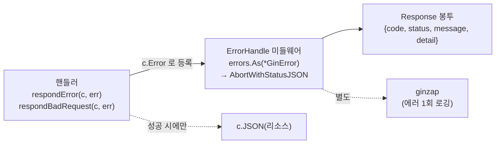

# 에러 처리 가이드

이 문서는 backend 의 **에러 처리 규칙**을 정의한다. 사내 `pos-connector` 프로젝트의 컨벤션과
Dave Cheney 의 "Don't just check errors, handle them gracefully" 가이드라인을 기반으로 한다.

> 요약 규칙은 `CLAUDE.md` §6 에 있다. 이 문서가 정식(canonical) 기준이며, 충돌 시 이 문서를 따른다.

## 핵심 원칙 세 가지

1. **에러는 값이다.** `Error()` 문자열을 파싱해서 분기하지 않는다. 분류는 `errors.Is` 로만 한다.
2. **맥락을 덧붙여 전파한다.** 에러는 발생 지점에서 `errors.Wrap` 으로 "무슨 작업 중이었는지"를 한 번 입힌다.
3. **딱 한 번만 처리한다.** "처리"란 로깅 또는 사용자 응답 생성을 뜻한다. 같은 에러를 로그도 남기고 다시 return 하는 중복 처리를 하지 않는다. 하위 레이어는 **반환만**, 최상단이 **한 번** 로깅/응답한다.

---

## 1. 에러의 분류 — 도메인 sentinel

도메인 에러는 `core/domain/errors.go` 에 `ConstantError` 로 정의한다. `string` 기반이라 `const` 가 되어 런타임에 치환 불가능한 안전한 sentinel 이 된다.

```go
type ConstantError string
func (e ConstantError) Error() string { return string(e) }

const (
    ErrNotFound     = ConstantError("요청한 리소스를 찾을 수 없습니다")
    ErrConflict     = ConstantError("리소스가 이미 존재합니다")
    ErrInvalidInput = ConstantError("입력값이 올바르지 않습니다")
)
```

- 이 값들은 도메인의 **공개 API** 다. 어댑터(HTTP)가 이를 상태코드로 매핑하므로 함부로 바꾸면 응답 계약이 깨진다.
- 식별은 항상 `errors.Is(err, domain.ErrNotFound)`. **타입 단언이나 문자열 비교 금지.**
- 새 분류가 필요할 때만 추가한다. sentinel 은 최소한으로 유지한다(가이드라인 권고).

> 가이드라인은 sentinel 최소화를 권하지만, 헥사고날 경계에서 "도메인이 의미하는 실패 종류"를 어댑터가 알아야 하므로 소수의 sentinel + `errors.Is` 를 절충안으로 채택한다. `errors.Is` 는 wrapping 을 통과하므로 강결합 문제(가이드라인이 지적한)가 완화된다.

---

## 2. 래핑 — 맥락 추가

래핑은 표준 `%w` 가 아니라 **`github.com/pkg/errors`** 로 통일한다(pos-connector 와 동일). `errors.Is/As/New/Errorf` 도 pkg/errors 가 재노출하므로 한 패키지만 import 하면 된다.

```go
import "github.com/pkg/errors"

if err := r.db.GetContext(ctx, &row, r.db.Rebind(q), id); err != nil {
    return nil, errors.Wrap(mapError(err), "카테고리 조회")
}
```

- **맥락은 발생 지점(주로 리포지토리)에서 한 번만** 입힌다.
- 동적 값이 필요하면 `errors.Wrapf(err, "태그 연결(tag_id=%d)", tagID)`.
- `errors.Wrap(nil, ...)` 는 `nil` 을 반환하므로, 성공 시 `nil` 을 반환하는 헬퍼를 감싸도 안전하다.

```go
// affectedOrNotFound 는 성공 시 nil, 영향 행 0이면 domain.ErrNotFound 반환 → 감싸도 OK
return errors.Wrap(affectedOrNotFound(res), "카테고리 수정")
```

### 중복 래핑 금지

서비스는 리포지토리 에러를 **그대로 전파**한다. 서비스에서 다시 래핑하면 `"수정: 수정: ..."` 처럼 맥락이 중복된다. 서비스는 자신이 **새로 만드는** 검증 에러(`domain.ErrInvalidInput` 등)만 직접 반환한다.

```go
func (s *categoryService) Update(ctx context.Context, id uint, in port.UpdateCategoryInput) (*domain.Category, error) {
    c, err := s.repo.GetByID(ctx, id)
    if err != nil {
        return nil, err // 그대로 전파 (리포지토리가 이미 맥락을 입힘)
    }
    if strings.TrimSpace(in.Name) == "" {
        return nil, domain.ErrInvalidInput // 새로 생성하는 검증 에러
    }
    ...
}
```

---

## 3. 레이어별 규칙

| 레이어 | 에러를 어떻게 다루나 | 로깅 |
|--------|--------------------|------|
| `core/domain` | sentinel 정의만 | ✗ |
| `core/service` | 검증 에러 생성, 하위 에러는 pass-through | ✗ |
| `core/storage` | `mapError` 로 sentinel 변환 후 `errors.Wrap` 으로 맥락 부여 | ✗ |
| `handler/http` | 에러를 `c.Error` 로 **등록만** (응답 직접 생성 X) | ✗ |
| `middleware`(ErrorHandle) | 등록된 에러를 HTTP 응답으로 변환 | ✗ |
| `ginzap` | — | ✓ (유일한 로깅 지점) |

### storage: 드라이버 에러 → 도메인 sentinel

`mapError`(`storage/db.go`)가 드라이버 에러를 도메인 sentinel 로 변환한다. 변환 후 `errors.Wrap` 으로 맥락을 입힌다.

```go
func mapError(err error) error {
    if err == nil { return nil }
    if errors.Is(err, sql.ErrNoRows) { return domain.ErrNotFound }
    msg := strings.ToLower(err.Error())
    switch {
    case strings.Contains(msg, "unique constraint failed"), // sqlite
        strings.Contains(msg, "duplicate key value"),       // postgres
        strings.Contains(msg, "sqlstate 23505"):
        return domain.ErrConflict
    }
    return err // 분류 불가 → 원본 (HTTP 에서 500)
}
```

신규 제약 위반 패턴이 생기면 여기에 추가한다.

---

## 4. HTTP 에러 응답 파이프라인

핸들러는 **에러 응답을 직접 만들지 않는다.** 도메인/입력 에러를 `c.Error` 로 등록만 하고, 변환은 `ErrorHandle` 미들웨어 한 곳에서 일어난다.



### 4.1 핸들러 — 등록만

```go
func (h *CategoryHandler) get(c *gin.Context) {
    id, ok := parseIDParam(c, "id")
    if !ok { return } // parseIDParam 이 respondBadRequest 등록
    out, err := h.svc.Get(c.Request.Context(), id)
    if err != nil {
        respondError(c, err) // 도메인 에러 등록
        return
    }
    c.JSON(http.StatusOK, newCategoryResponse(out)) // 성공만 c.JSON
}
```

- 도메인 에러: `respondError(c, err)` → `fromDomain` 이 `errors.Is` 로 `ErrorCode` 매핑.
- 입력/바인딩 에러: `respondBadRequest(c, err)`.
- **핸들러에서 에러를 `c.JSON` 으로 직접 쓰지 않는다.** 성공 응답에만 `c.JSON`.
- 호출 직후 반드시 `return`.

### 4.2 ErrorCode 와 매핑 (`ginerror.go`)

HTTP 상태 매핑은 `ErrorCode.StatusCode()` **한 곳**에 집중한다.

```go
type ErrorCode int
const ( ErrInternal ErrorCode = iota; ErrNotFound; ErrBadParamInput; ErrConflict )

func (c ErrorCode) StatusCode() int { /* ErrNotFound→404, ErrBadParamInput→400, ErrConflict→409, default→500 */ }
func (c ErrorCode) Message() string { /* 사용자 노출용 안전 문구 */ }

func fromDomain(err error) *GinError {
    switch {
    case errors.Is(err, domain.ErrNotFound):     return wrapGinError(err, ErrNotFound)
    case errors.Is(err, domain.ErrConflict):     return wrapGinError(err, ErrConflict)
    case errors.Is(err, domain.ErrInvalidInput): return wrapGinError(err, ErrBadParamInput)
    default:                                      return wrapGinError(err, ErrInternal)
    }
}
```

`GinError` 는 `Unwrap()` 을 구현해 `errors.Is/As` 체인을 보존한다.

### 4.3 ErrorHandle 미들웨어 (`middleware.go`)

```go
func ErrorHandle() gin.HandlerFunc {
    return func(c *gin.Context) {
        c.Next()
        if len(c.Errors) == 0 { return }
        err := c.Errors.Last().Err
        var ginErr *GinError
        if !errors.As(err, &ginErr) || ginErr == nil {
            c.AbortWithStatusJSON(http.StatusInternalServerError, Response{
                Code: int(ErrInternal), Status: http.StatusInternalServerError, Message: ErrInternal.Message(),
            })
            return
        }
        resp := Response{ Code: int(ginErr.Code()), Status: ginErr.Code().StatusCode(), Message: ginErr.Code().Message() }
        if ginErr.Code() != ErrInternal {
            resp.Detail = ginErr.Error() // 4xx 만 디버깅용 상세 포함
        }
        c.AbortWithStatusJSON(resp.Status, resp)
    }
}
```

### 4.4 응답 봉투 (`Response`)

| 필드 | 의미 |
|------|------|
| `code` | 애플리케이션 `ErrorCode`(int) |
| `status` | HTTP 상태 코드 |
| `message` | 사용자 노출용 안전 문구 |
| `detail` | **4xx 에 한해** 디버깅용 원본 에러 문자열 (`omitempty`) |

```json
// 404
{"code":1,"status":404,"message":"요청한 리소스를 찾을 수 없습니다","detail":"태그 조회: 요청한 리소스를 찾을 수 없습니다"}
// 409
{"code":3,"status":409,"message":"리소스가 이미 존재합니다","detail":"태그 생성: 리소스가 이미 존재합니다"}
```

> **보안**: 500(`ErrInternal`)에는 `detail` 을 넣지 않는다(SQL/내부 상세 유출 방지). pos-connector 는 원본을 항상 노출하지만, 본 프로젝트는 내부 오류 상세를 가린다.

> **성공 응답**: 현재 목록은 `{"data": [...]}`, 단건은 리소스 객체 직접 반환. 에러만 `Response` 봉투를 쓰는 부분 채택 상태다. 성공까지 통일하려면 별도 결정 후 일괄 적용한다.

---

## 5. 로깅 / panic

- 미들웨어 등록 순서: `Ginzap → RecoveryWithZap → ErrorHandle`. 후처리는 **역순**으로 실행되므로 ErrorHandle 이 응답을 만든 뒤 Ginzap 이 최종 상태/에러를 로깅한다. → **응답=ErrorHandle, 로깅=Ginzap** 으로 책임 분리(에러 1회 처리).
- panic 복구는 `ginzap.RecoveryWithZap` 을 그대로 쓴다. 커스텀 recover 를 만들지 않는다.
- 하위 레이어(service/storage)는 **로깅하지 않는다.** `zap.Error(err)` 를 하위에서 호출하면 ginzap 재로깅과 겹쳐 같은 에러가 중복 기록된다.
- **알려진 노이즈**: ginzap 기본 설정은 4xx 클라이언트 오류도 error 레벨 + stacktrace 로 남긴다. 노이즈가 문제되면 상태코드별 로그 레벨을 조정하는 커스텀 로깅 미들웨어 도입을 검토한다.

---

## 6. 새 에러를 추가할 때

1. 도메인 분류가 필요하면 `core/domain/errors.go` 에 `ConstantError` 추가.
2. `ginerror.go` 에 대응 `ErrorCode` 추가 + `StatusCode()`/`Message()`/`fromDomain` 갱신.
3. 리포지토리에서 새 드라이버 에러를 분류해야 하면 `storage/db.go` 의 `mapError` 에 패턴 추가.
4. 에러를 반환하는 곳은 `errors.Wrap(..., "작업명")` 으로 맥락을 입힌다.

---

## 7. Do / Don't

**Do**
- `errors.Is` 로 분류, `errors.Wrap` 으로 맥락 추가.
- 에러는 발생 지점에서 한 번 래핑.
- 핸들러는 `respondError`/`respondBadRequest` 로 등록만.
- 로깅은 최상단(ginzap)에서 한 번.

**Don't**
- `err.Error()` 문자열 비교로 분기하지 않기.
- 같은 에러를 로그 + return 으로 중복 처리하지 않기.
- 핸들러에서 에러를 `c.JSON` 으로 직접 쓰지 않기.
- 서비스에서 리포지토리 에러를 다시 래핑하지 않기.
- 500 응답에 내부 에러 상세를 노출하지 않기.

---

## 참고

- Dave Cheney, "Don't just check errors, handle them gracefully" — https://dave.cheney.net/2016/04/27/dont-just-check-errors-handle-them-gracefully
- 사내 `pos-connector` 의 `gin/errors`, `gin/middleware/error_handle.go`, `core/domain/errors.go`
