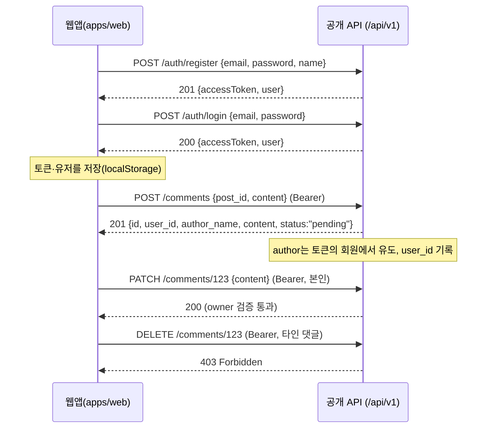

# 사용자(회원) 인증 · 댓글 소유권 API 요청서 (백엔드 전달용)

사용자용 웹앱(`frontend/apps/web`)에 **회원 가입/로그인/정보수정**과 **로그인 사용자의 댓글 작성 · 본인 댓글 수정/삭제**를 추가했다.
현재 백엔드에는 일반 회원 개념이 없고(관리자 `admin_user`만 존재), 공개 댓글은 익명(`author_name`)으로만 작성되므로 아래 기능을 **공개 API(`/api/v1`)에 추가**해 달라는 요청서다.

- 회원 인증 엔드포인트는 공개 API 네임스페이스 **`/api/v1/auth/*`** 아래(관리자 `/admin/api/v1/auth/*`와 분리).
- 인증 방식: **JWT Bearer**(회원용). `Authorization: Bearer <accessToken>`.
- **회원 토큰과 관리자 토큰은 반드시 분리**한다(서명 키/audience 분리). 회원 토큰으로 관리자 API 접근 불가, 그 반대도 불가.

---

## 1. 흐름

---

## 2. 엔드포인트

베이스: `http://localhost:9000/api/v1`

### 2.1 회원 인증/계정

| 메서드 | 경로 | 인증 | 설명 |
| --- | --- | --- | --- |
| POST | `/auth/register` | 불필요 | 회원 가입 → 토큰 + 회원 반환 |
| POST | `/auth/login` | 불필요 | 로그인 → 토큰 + 회원 반환 |
| GET | `/auth/me` | Bearer | 현재 회원 정보 |
| PATCH | `/auth/me` | Bearer | 회원 정보 수정(이름/이메일/비밀번호) |
| POST | `/auth/logout` | Bearer | (선택) 서버 측 토큰 무효화 |
| POST | `/auth/refresh` | refresh token | (선택) 액세스 토큰 갱신 |

#### `POST /auth/register`
요청: `{ "email": "user@example.com", "password": "secret", "name": "홍길동" }`
응답 201: `{ "accessToken": "<JWT>", "refreshToken": "<optional>", "user": User }`
- 이메일 중복 시 409 `{ "message": "이미 가입된 이메일입니다." }`

#### `POST /auth/login`
요청: `{ "email", "password" }` → 200 `{ "accessToken", "refreshToken?", "user": User }`
- 실패 401 `{ "message": "이메일 또는 비밀번호가 올바르지 않습니다." }`

#### `GET /auth/me` → 200 `User`

#### `PATCH /auth/me` (부분 수정)
요청(모두 선택): `{ "name"?, "email"?, "password"?, "currentPassword"? }`
- `password` 변경 시 `currentPassword` 검증 권장. 응답 200 `User`.

### 2.2 댓글(소유권)

| 메서드 | 경로 | 인증 | 설명 |
| --- | --- | --- | --- |
| GET | `/posts/:id/comments` | 불필요 | 게시글 댓글 목록(응답에 `user_id` 포함) |
| POST | `/comments` | **Bearer** | 로그인 회원 댓글 작성 |
| PATCH | `/comments/:id` | **Bearer(본인)** | 본인 댓글 내용 수정 |
| DELETE | `/comments/:id` | **Bearer(본인)** | 본인 댓글 삭제 |

#### `POST /comments` (로그인 작성)
요청: `{ "post_id": 1, "content": "좋은 글이네요." }`
- **작성자(author)는 토큰의 회원에서 유도**한다(`user_id` 기록, `author_name`은 회원 이름으로 채움). 클라이언트는 author 정보를 보내지 않는다.
- 응답 201: `Comment`(아래). 기본 상태 `pending`(검수 후 노출) 권장.

#### `PATCH /comments/:id` 요청 `{ "content": "..." }`
#### 소유권 규칙(필수)
- 토큰 회원의 `user_id != comment.user_id` 이면 **403 Forbidden**. 토큰 없음/만료는 **401**.
- 관리자 API(`/admin/api/v1/comments`)는 기존대로 관리자가 전체 관리(상태 변경 등). 공개 API의 수정/삭제는 **본인 소유 댓글로 한정**.

> 현재 공개 `PUT/DELETE /comments/:id`는 인증 없이 누구나 호출 가능하다. **반드시 회원 인증 + 소유권 검증으로 보호**해야 한다(미보호 시 임의 댓글 변조·삭제 가능).

---

## 3. 데이터 모델

### `User`(회원)
| 필드 | 타입 | 설명 |
| --- | --- | --- |
| `id` | integer | 회원 ID |
| `email` | string | 로그인 이메일(유일) |
| `name` | string | 표시 이름 |
| `avatar` | string? | 프로필 이미지 URL(선택) |
| `created_at` | datetime | |
| `updated_at` | datetime | |

> 비밀번호 해시는 응답에 포함하지 않는다.

### `Comment` 변경점
기존 공개 댓글 필드에 **`user_id`(nullable)** 를 추가한다.

| 필드 | 타입 | 설명 |
| --- | --- | --- |
| `id` | integer | |
| `post_id` | integer | |
| `user_id` | integer? | 작성 회원 ID. 익명/레거시는 null |
| `author_name` | string | 표시 이름(회원 작성 시 회원 이름) |
| `content` | string | |
| `status` | string | `pending|approved|spam` |
| `created_at` | datetime | |

- 공개 목록 응답에 **`user_id`를 포함**해야 웹앱이 "내 댓글"을 식별해 수정/삭제 버튼을 노출한다.

---

## 4. 구현 시 필수 사항

1. **소유권은 서버에서 강제**한다. 공개 댓글 수정/삭제는 토큰 회원 == 댓글 작성자일 때만 허용(아니면 403), 미인증은 401.
2. **회원 토큰 ≠ 관리자 토큰**: 서명 키/audience를 분리해 상호 접근을 차단한다.
3. 비밀번호는 **bcrypt 등으로 해시** 저장, 이메일 **유일성** 제약, 로그인/가입 **레이트 리밋** 권장.
4. JWT 만료(예: 액세스 60분), `sub`(회원 id) 클레임 포함. 리프레시 토큰 사용 시 회전 권장.
5. **CORS**: 웹앱 출처 허용 + `Authorization` 헤더 허용 + 목록 헤더(`X-Total-Count`는 공개 목록엔 미사용, 현 `{data}` 엔벨로프 유지).
6. 공개 API 응답 규약 유지: 목록 `{ "data": [...] }`, 필드 snake_case, 에러 `{ "message": "..." }`.

---

## 5. 웹앱 측 동작 요약(참고)

- 가입/로그인 성공 시 `accessToken`+`user`를 저장하고 공개 API 요청에 Bearer 주입.
- 비로그인 상태에서는 댓글 폼 대신 "로그인 후 작성" 안내. 로그인 시 내용만 입력해 작성(작성자는 토큰에서 유도).
- 댓글 목록에서 `comment.user_id === 현재 회원.id` 인 항목에만 수정/삭제 노출.
- 관련 구현: `frontend/apps/web/src/shared/{store/auth-store,api/http-client}.ts`, `entities/user`, `pages/{login,register,profile}`, `pages/post-detail/ui/comment-*`.
